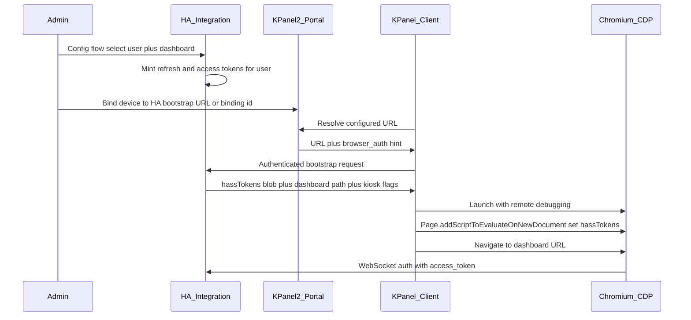

# HA KPanel Dashboard + KPanel2 Auth Bridge

> **Living plan** — update this file as design or phase status changes.
> Location: `.cursor/plans/ha_kpanel_auth_bridge.plan.md` (KPanel2 parent repo)

## Repo ownership (updated)

| Role | Repo / path |
|------|-------------|
| Parent repo | `KPanel2/kpanel2` |
| Submodule | `ha-kpanel-dashboard` (HACS plugin repo) |

Porting the plan is straightforward: this file lives in KPanel2; open Cursor on the KPanel2 workspace for implementation. Technical design below stays the same; only ownership/layout flips.

### Suggested submodule path in KPanel2

```
kpanel2/
  integrations/ha-kpanel-dashboard/   # git submodule → HACS plugin
  backend/
  frontend/
  client-system/
  docs/
```

HACS still publishes from the submodule’s own git history/releases; KPanel2 pins a known-good submodule commit for coordinated client/protocol work.

**Current status:** submodule wired at `integrations/ha-kpanel-dashboard` (see `.gitmodules`).

---

## Feasibility verdict

**Yes — approach C is possible**, with an important constraint:

- A **frontend-only** HACS plugin cannot invent passwordless username login (same limit as kiosk-mode).
- A **custom integration** running inside Home Assistant can select a user and mint auth tokens via `hass.auth.async_create_refresh_token` / access-token APIs.
- KPanel2 can then seed the Chromium session by writing `localStorage.hassTokens` **before** HA frontend JS runs (proven pattern used by DashboardRecorder / Playwright `add_init_script`). On a Pi kiosk this is done via **Chrome DevTools Protocol (CDP)**, not Playwright.

So “auto-authenticate username X to dashboard Y on a KPanel device” is achievable as an **HA integration + KPanel client protocol**, not as a pure Lovelace JS plugin.

---

## Architecture



- **Primary auth:** server-minted refresh/access token pair injected as `hassTokens` (supports real frontend refresh).
- **Fallback (documented):** HA `trusted_networks` + `trusted_users` + `allow_bypass_login` and/or KPanel’s existing persistent Chromium profile.

---

## Repo layout (KPanel2 parent + HA submodule)

| Path | Role |
|------|------|
| [`integrations/ha-kpanel-dashboard/custom_components/kpanel_dashboard/`](integrations/ha-kpanel-dashboard/custom_components/kpanel_dashboard/) | HACS integration (Python): user selection, token minting, bootstrap API, config flow |
| [`integrations/ha-kpanel-dashboard/`](integrations/ha-kpanel-dashboard/) `www/` frontend bundle | Lovelace module: kiosk chrome (hide header/sidebar), URL query overrides |
| [`backend/`](backend/), [`frontend/`](frontend/), [`client-system/`](client-system/) | Portal binding UI, resolve payload extension, CDP session seeder |

---

## Home Assistant integration (submodule)

### Config / domain model

- Config entry fields: `user_id` (selected HA user), display username, `dashboard_path` (e.g. `/lovelace/kiosk`), kiosk UI options, optional binding secret / device allowlist.
- On setup (and on rotate service): create a dedicated refresh token for that user with a stable `client_id` derived from the HA external URL; store token id in entry (not necessarily the secret long-term if re-mintable); expose bootstrap that returns a short-lived signed payload containing current access + refresh tokens shaped for `hassTokens`.

### HTTP bootstrap endpoint

- e.g. `GET /api/kpanel_dashboard/bootstrap`
- **Auth:** shared binding secret (header) and/or HMAC over `device_id` + timestamp (KPanel device proves possession of portal-issued secret).
- **Response:** `{ hass_url, hass_tokens, dashboard_url, kiosk }`.
- Rate-limit + audit log; revoke/rotate via service `kpanel_dashboard.rotate_tokens`.

### Frontend module (kiosk chrome)

- HACS frontend resource similar to kiosk-mode: `hide_header`, `hide_sidebar`, `kiosk`, query overrides (`?kiosk`).
- Keep scope to chrome only; auth stays in the integration + KPanel client.

### HACS packaging

- `hacs.json`, `custom_components/kpanel_dashboard/manifest.json`, README with install, security model, trusted_networks fallback.
- Keep the submodule independently releasable for HACS default/custom repo install.

---

## KPanel2 changes (parent repo)

### Portal / backend

Extend device config with optional `ha_kpanel` binding: HA base URL, bootstrap path, binding secret, dashboard override.

Extend `devices/resolve` (or companion field) with:

```json
{
  "configured_url": "https://ha.example/lovelace/kiosk",
  "browser_auth": {
    "type": "ha_hass_tokens",
    "bootstrap_url": "https://ha.example/api/kpanel_dashboard/bootstrap",
    "binding_secret_ref": "..."
  }
}
```

Secrets delivered only over existing authenticated device channel (`X-Device-Token`).

### Client (`client-system`)

After resolve, if `browser_auth.type == ha_hass_tokens`:

1. Call bootstrap URL with binding credentials.
2. Launch Chromium with existing kiosk flags plus `--remote-debugging-port=<ephemeral>` (localhost only).
3. Via CDP: `Page.addScriptToEvaluateOnNewDocument` → `localStorage.setItem('hassTokens', ...)`.
4. Navigate to `dashboard_url`.
5. Reuse existing `--user-data-dir` so subsequent boots can skip bootstrap if tokens still valid; re-bootstrap on auth failure.

Unit-test CDP seeder with mocks; keep launch path DRY with current `client-system/kpanel_client/ui.py` `launch_kiosk`.

---

## Engineering standards (required)

- **TDD:** red/green for token minting, bootstrap auth, payload schema, CDP script builder, resolve DTO parsing.
- **DRY / SOLID:** separate `AuthTokenService`, `BootstrapAuth`, `KioskConfig`, `CdpSessionSeeder`; no god-modules.
- **Python:** PEP 8 + black (+ ruff/isort as used in each repo); type hints on public APIs.
- **HA submodule:** pytest + `pytest-homeassistant-custom-component` (or HA’s pytest plugin pattern).
- **KPanel2:** follow existing backend/client test layout; ≥90% coverage on new/changed code (100% preferred).

---

## Security model (non-negotiable)

- Never put LLAT/refresh secrets in the public dashboard URL.
- Prefer integration-minted tokens scoped to a **non-admin** kiosk user with locked-down dashboard access.
- Binding secrets rotatable; CDP debugging port bound to `127.0.0.1` only.
- Document that anyone with physical access to the panel can use that user’s HA session—same class of risk as `trusted_networks` kiosks.

---

## Implementation phases

| # | Phase | Status |
|---|-------|--------|
| 1 | Add `integrations/ha-kpanel-dashboard` submodule to KPanel2; port this plan into KPanel2; open Cursor on KPanel2 | **done** (submodule + this plan) |
| 2 | Scaffold HA integration in the submodule (manifest, config flow: select user + dashboard, empty bootstrap) | **done** — config flow + binding-secret confirm step + options rotate/reveal |

| 3 | Token service + bootstrap API with full unit/integration tests | **done** — `AuthTokenService`, ready bootstrap `hassTokens`, `rotate_tokens` service, rate limit, tests ≥90% |
| 4 | Frontend kiosk module + HACS metadata | **done** — `www/kpanel-kiosk.js` (`?kiosk` / hide flags), static path + deferred `add_extra_js_url`, node + pytest |
| 5 | KPanel2 API/portal binding + client CDP seeder | **done** — resolve/`config` `browser_auth`, account PATCH + portal device-card HA binding UI, client CDP seeder + kiosk remote-debug launch |
| 6 | E2E doc path: claim device → bind HA → boot → land on dashboard without login form | **done** — `docs/ha-kpanel-auth-bridge.md` |
| 7 | Docs: security, trusted_networks fallback, troubleshooting (proxy/`hassTokens` quirks) | **done** — same doc + architecture link |

---

## Out of scope for v1

- Unsupported custom HA auth providers / core patches.
- Long-lived token pasted into the public URL query string.
- Replacing NemesisRE/kiosk-mode feature-for-feature (ship a focused subset; users may still use kiosk-mode if preferred).
